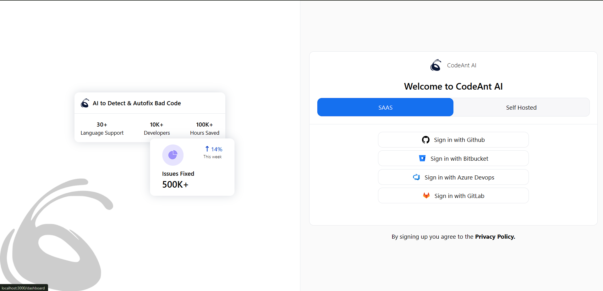
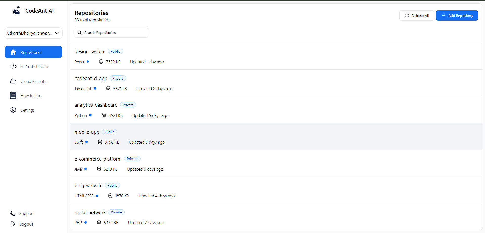

# CodeAnt AI: Frontend Developer Assignment  

This repository contains the solution for the **Frontend Developer Intern Assignment** provided by CodeAnt AI. The task focuses on developing a functional frontend interface based on the given Figma design.  

---





## Goals  
- Precisely implement the design from the Figma file.  
- Deliver a fully functional and responsive user interface across devices.  
- Adhere to clean coding practices and modern industry standards.  

---

## Technologies Used  
- **ReactJS**: For building the user interface.  
- **CSS**: For styling and responsiveness.  
- **HTML**: For structuring the application.  
- **Vite**: For fast development and build process.  

---

## Installation  

Follow these steps to set up the project locally:  

1. **Clone the repository**:  
   ```bash  
   git clone <add repo link>
   cd codeantai
   ```  

2. **Install dependencies**:  
   ```bash  
   npm install  
   ```  

3. **Start the development server**:  
   ```bash  
   npm run dev  
   ```  

4. **View the project in your browser**:  
   Open `http://localhost:3000` in your browser.  

---
